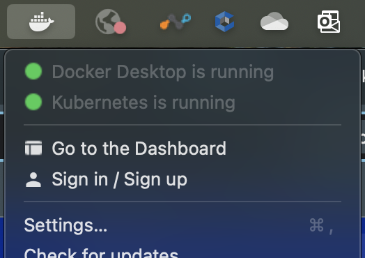
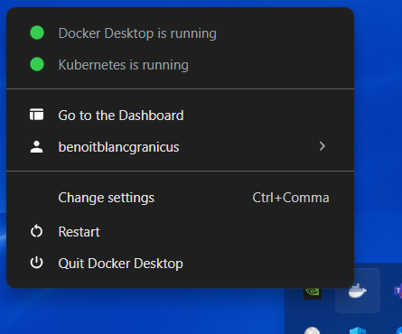

# SV Kubernetes in Docker

Running sv-kubernetes using Docker Desktop requires the following
features and systems:

* On Windows:
  * [WSL v2](../readme_wsl.md#install-wsl)
  * [Docker Desktop WSL2 backend](../readme_wsl.md#install-docker-engine)
  * [sv-kubernetes] github repo checked out to `C:\sv-kubernetes`

* On MacOS:
  * [Git](https://git-scm.com/downloads/mac) (requires [Homebrew](https://brew.sh/))
  * [Docker Engine](#docker-engine)
  * [Network interface alias](#network-interface-alias-macos-only)
  * [sv-kubernetes] github repo checked out to `/Users/Shared/sv-kubernetes`

* On both:
  * Local admin permissions (ability to run sudo and install softwares)
  * A `github_key` stored at `~/.ssh/github_key` (mode 600)

## Docker Engine

Follow the [Docker Desktop documentation](https://docs.docker.com/desktop/setup/install/mac-install/) to install it.

After installation, follow the instructions to [Enable Kubernetes](https://docs.docker.com/desktop/features/kubernetes/#install-and-turn-on-kubernetes).

You can verify that everything is running by clicking on the Docker
tray icon on the top-right of the screen (MacOS) or bottom-right
(Windows).




## Network interface alias (MacOS only)

In order to be able to access services via `sv-kube-proxy` the host
needs to be accessible on `192.168.50.100`. In this section we will
create a task to automatically add this IP address as an alias at
startup

In a terminal, elevate your user to root by running `sudo -i`

Then run the following commands:

```bash
cat <<-'EOF' > /Library/LaunchDaemons/sv-kubernetes.ifconfig.plist
<?xml version="1.0" encoding="UTF-8"?>
<!DOCTYPE plist PUBLIC "-//Apple Computer//DTD PLIST 1.0//EN" "http://www.apple.com/DTDs/PropertyList-1.0.dtd">
<plist version="1.0">
<dict>
    <key>Label</key>
    <string>sv-kubernetes.ifconfig</string>
    <key>RunAtLoad</key>
    <true/>
    <key>ProgramArguments</key>
    <array>
      <string>/sbin/ifconfig</string>
      <string>lo0</string>
      <string>alias</string>
      <string>192.168.50.100</string>
    </array>
</dict>
</plist>
EOF
```

```bash
launchctl enable system/sv-kubernetes.ifconfig
```

## Run sv-kubernetes container

SV Kubernetes runs in a Docker container from which you can run all
your usual `sv` commands.

Go to `/Users/Shared/sv-kubernetes` (MacOS) or `/mnt/c/sv-kubernetes`
(Windows WSL), run `bash docker/install.sh` to build and run the
`sv-kubernetes` container.

At the end of the setup, it will ask you to go through the Google Cloud
authentication process. If you skipped it you can reconnect at any time
by running `gcloud auth login --update-adc --no-launch-browser` in the
container.

## Usage

From there you can enter the container with `docker exec -it sv-kubernetes bash`
and run commands from there or directly run commands from the host using
`docker exec -it sv-kubernetes [CMD]`.

Run `docker exec -it sv-kubernetes sv` to get the list of available
commands.

`kubectl` commands can be run either from the host terminal or inside
the `sv-kubernetes` container.

> An `alias` is added to `~/.bashrc` so you can use `sv [CMD]` directly


## Troubleshooting

### MacOS

* Is the IP alias setup properly?
  * In a terminal, run `ifconfig | grep 192.168.50.100`. It should return
    something like `inet 192.168.50.100 netmask 0xffffff00`. If nothing
    is returned, make sure you went through the _[Network interface alias](#network-interface-alias-macos-only)_
    setup
* `hostPort` entries are failing because a low port cannot be used.
  * When use hostPort you can also declare the service as of
    `type: LoadBalancer` and do not declare an IP address. It will still
    be accessible at the main `192.168.50.100:PORT`

### Windows WSL

For troubleshooting on Windows, see [WSL documentation](../readme_wsl.md#debugging)


[sv-kubernetes]: https://github.com/simpleviewinc/sv-kubernetes
